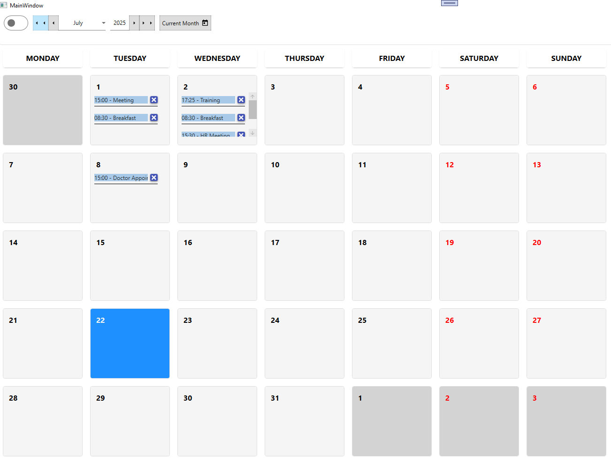
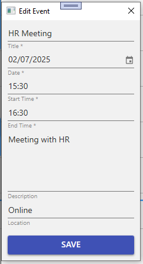

# 📅 CalendarExample

This WPF project demonstrates how to use the [`CalendarControl`](https://github.com/SalvatoreAmaddio/CalendarControl) — a flexible, Material Design-based calendar component supporting **month** and **week views**, event management, and drag-and-drop functionality.

---

## 📸 Preview
### Month View:


### toggle for Week View:


### Click on slots to add/edit events:


---

## 🚀 Features Demonstrated

- ✅ Switching between **month** and **week view**
- ✅ Navigating between months and weeks
- ✅ Binding a collection of events (`ObservableCollection<EventModel>`)
- ✅ Handling **Add**, **Delete**, and **Drop** commands
- ✅ Displaying events with time and title
- ✅ Styled using [MaterialDesignInXAML](https://github.com/MaterialDesignInXAML/MaterialDesignInXamlToolkit)

---

## 🔧 Requirements

- .NET 6.0 or newer
- WPF
- [MaterialDesignThemes](https://www.nuget.org/packages/MaterialDesignThemes/)
- [CalendarControl](https://www.nuget.org/packages/CalendarControl)

---

## 📦 NuGet Packages Used

```bash
dotnet add package CalendarControl --version 1.0.3
dotnet add package MaterialDesignThemes
```

or copy and paste
```
<PackageReference Include="CalendarControl" Version="1.0.3" />
```

## How To Use:
Import the namespace:

```xaml
    xmlns:calendar="clr-namespace:CalendarControl;assembly=CalendarControl"
```

And then:

```xaml
    <Grid>
        <calendar:Calendar x:Name="calendar" 
                           Date="{Binding Date, Mode=TwoWay}"
                           Events="{Binding Events, Mode=TwoWay}"
                           IsWeekView="{Binding IsWeekView, Mode=TwoWay}"
                           Culture="{x:Static local:Cultures.US}"
                           DeleteCommand="{Binding DeleteCommand}"
                           SelectedEventCommand="{Binding SelectedEventCommand}"
                           AddEventCommand="{Binding AddEventCommand}"
                           EventDropCommand="{Binding EventDropCommand}"
                           IsLoading="{Binding IsLoading}"
                           />
    </Grid>
```

Example of ViewModel can be found in the [`ViewModels`](https://github.com/SalvatoreAmaddio/CalendarExample/tree/master/ViewModels) 
folder.

## Explaining The EventDrop Command
In the CalendarControl the EventDropCommand is invoked after an event record 
has been moved via drag-and-drop. It receives an updated IDatable object. 
The control has already modified the DateOf, StartTime, and EndTime properties, 
and the command is responsible for saving the updated data. For example in your ViewModel:
```csharp

    public ICommand EventDropCommand => new AsyncRelayCommand<IDatable>(EventDropAsync);

    private async Task EventDropAsync(IDatable? datable)
    {
        if (datable is EventModel model)
        {
            await DatabaseManager.UpdateEventAsync(model); //update in the database
        }
    }
```