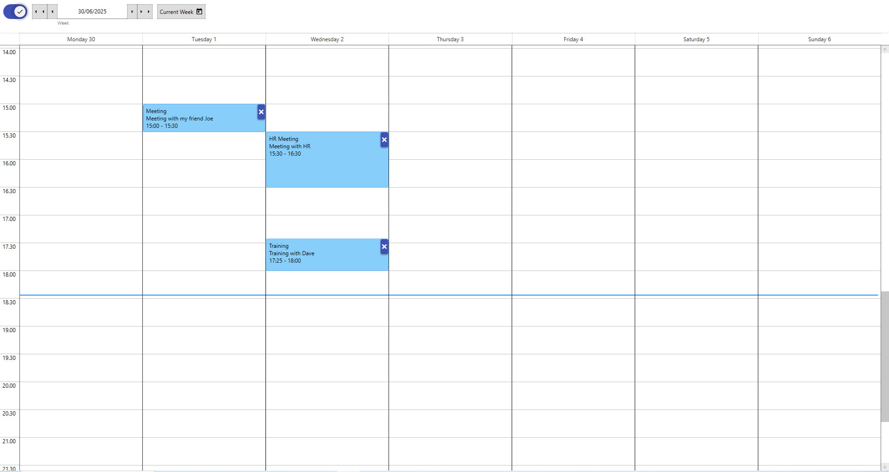

# 📅 CalendarExample

This WPF project demonstrates how to use the [`CalendarControl`](https://github.com/SalvatoreAmaddio/CalendarControl) — a flexible, Material Design-based calendar component supporting **month** and **week views**, event management, and drag-and-drop functionality.

---

## 📸 Preview
### Month View:


### Toggle for Week View:


### Click on slots to add/edit events:


---

## 🚀 Features Demonstrated

- ✅ Switching between **month** and **week view**
- ✅ Navigating between months and weeks
- ✅ Binding a collection of events (`ObservableCollection<EventModel>`)
- ✅ Handling **Add**, **Delete**, and **Drop** commands
- ✅ Displaying events with time and title
- ✅ Styled using [MaterialDesignInXAML](https://github.com/MaterialDesignInXAML/MaterialDesignInXamlToolkit)

---

## 🔧 Requirements

- .NET 6.0 or newer
- WPF
- [MaterialDesignThemes](https://www.nuget.org/packages/MaterialDesignThemes/)
- [CalendarControl](https://www.nuget.org/packages/CalendarControl)

---

## 📦 NuGet Packages Used

```bash
dotnet add package CalendarControl --version 1.0.3
dotnet add package MaterialDesignThemes
```

or copy and paste
```
<PackageReference Include="CalendarControl" Version="1.0.3" />
```

## How To Use:
Import the namespace:

```xaml
    xmlns:calendar="clr-namespace:CalendarControl;assembly=CalendarControl"
```

And then:

```xaml
    <Grid>
        <calendar:Calendar x:Name="calendar" 
                           Date="{Binding Date, Mode=TwoWay}"
                           Events="{Binding Events, Mode=TwoWay}"
                           IsWeekView="{Binding IsWeekView, Mode=TwoWay}"
                           Culture="{x:Static local:Cultures.US}"
                           DeleteCommand="{Binding DeleteCommand}"
                           SelectedEventCommand="{Binding SelectedEventCommand}"
                           AddEventCommand="{Binding AddEventCommand}"
                           EventDropCommand="{Binding EventDropCommand}"
                           IsLoading="{Binding IsLoading}"
                           />
    </Grid>
```

Example of ViewModel can be found in the [`ViewModels`](https://github.com/SalvatoreAmaddio/CalendarExample/tree/master/ViewModels) 
folder.

## Explaining The EventDrop Command
In both views, the user can drag and drop events from one day to another. 
However, the even should be updated into the database. 
In the CalendarControl the EventDropCommand is invoked after a calendar event 
has been moved via drag-and-drop. It receives an updated IDatable object. 
The control has already modified the DateOf, StartTime, and EndTime properties, 
and the command is responsible for saving the updated data. For example in your ViewModel:
```csharp

    public ICommand EventDropCommand => new AsyncRelayCommand<IDatable>(EventDropAsync);

    private async Task EventDropAsync(IDatable? datable)
    {
        if (datable is EventModel model)
        {
            await DatabaseManager.UpdateEventAsync(model); //update in the database
        }
    }
```

## Explaining The AddEvent Command
In the CalendarControl the AddEventCommand is invoked when the user wants to add a new calendar event.
The command should implement a logic to open a new Window so that the user can add the new event. 
For instance in your ViewModel you could have:
```csharp

    public ICommand AddEventCommand => new RelayCommand<object?>(AddEvent);

    private void AddEvent(object? obj)
    {
        EventModel eventModel = new();

        if (obj is DateTime date) //this occurs when adding event from MonthView when clicking on a DayCard object
        {
            eventModel.DateOf = date;
        }
        else if (obj is PlaceholderEvent pEvent) //this occurs when adding event from WeekView when clicking on an empty slot.
        {
            eventModel.DateOf = pEvent.DateOf;
            eventModel.StartTime = pEvent.StartTime;
            eventModel.EndTime = pEvent.EndTime;
        }

        OpenView?.Invoke(this, eventModel); //helper event to open a Window from the UI.
    }
```

## Explaining The SelectedEvent Command
In the CalendarControl the SelectedEventCommand is invoked when the user clicks on calendar event.
The command should implement a logic to open a new Window so that the user can edit the details of the event. 
For instance in your ViewModel you could have:
```csharp

    public ICommand SelectedEventCommand => new AsyncRelayCommand<IDatable?>(SelectedEventAsync);

    private async Task SelectedEventAsync(IDatable? datable)
    {
        if (datable is null)
            return;

        //fetch the full event, you might want to also fetch other joining tables if you are using EF
        EventModel? eventModel = await DatabaseManager.GetByIdAsync(datable.Id);

        if (eventModel is not null)
        {
            OpenView?.Invoke(this, eventModel);
        }
    }
```

## Explaining The Delete Command
In the CalendarControl the DeleteCommand is invoked when the user wants to delete an event.
The command should implement a logic to remove the event from the Database and also from the Calendar Control. 
For instance in your ViewModel you could have:
```csharp

    public ICommand DeleteCommand => new AsyncRelayCommand<IDatable>(DeleteAsync);

    private async Task<bool> DeleteAsync(IDatable? datable)
    {
        bool deleted = false;

        MessageBoxResult answer = MessageBox.Show("Are you sure you want to delete this event?", "Wait!", MessageBoxButton.YesNo, MessageBoxImage.Question);

        if (answer == MessageBoxResult.No)
            return deleted;

        if (datable is not null)
        {
            deleted = await DatabaseManager.DeleteAsync(datable.Id);
            Events.Remove(datable);
            Events = [.. Events]; //this is necessary to refresh the UI
            OnPropertyChanged(nameof(Events));
        }

        return deleted;
    }
```